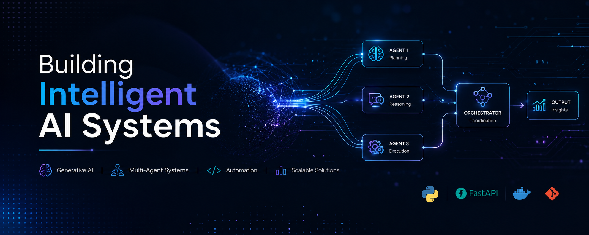

  

<h1 align="center">Hi there, I'm Urvashi Sharma 👋</h1>

  <em>AI/ML Engineer | Generative AI | Python | Intelligent Systems</em>

  <b>Machine Learning • Multi-Agent Systems • NLP • AI Automation • FastAPI • Python</b>

---

### 🚀 About Me

- 🧠 Building AI-powered systems focused on Generative AI, multi-agent workflows, NLP, and intelligent automation.
- ⚙️ Interested in designing practical AI solutions using Python, FastAPI, modular architectures, and scalable workflow orchestration.
- 🚀 Recently developed projects around AI advertisement generation and multi-agent orchestration systems with deployment-focused engineering practices.
- 📚 Continuously exploring LLM systems, agentic workflows, retrieval pipelines, and modern AI engineering concepts.
- 🏅 IEEE-published researcher with a strong foundation in machine learning, analytical problem-solving, and systems thinking.

---

### 🛠️ Skills & Tools

- **Programming & Backend:** Python, SQL, FastAPI, REST APIs, Git
- **AI & Machine Learning:** Machine Learning, NLP, LSTM, Scikit-learn, TensorFlow, Feature Engineering, Model Evaluation
- **Generative AI & Intelligent Systems:** Prompt Engineering, Multi-Agent Workflows, AI Automation, Retrieval Pipelines, Workflow Orchestration
- **Data & Workflow Engineering:** Pandas, NumPy, Data Preprocessing, Structured Logging, Modular Pipeline Design
- **Deployment & Engineering Practices:** Docker, API Integration, Reproducible Workflows, System Observability
- **Collaboration & Workflow:** Agile Workflows, Technical Documentation, Cross-functional Collaboration

---

### 🌟 Featured Projects

- [Multi-Agent Orchestration System](#)  
  Production-style multi-agent AI system featuring centralized orchestration, shared memory, retrieval workflows, critique-based self-evaluation, structured tooling, FastAPI integration, Dockerized deployment, and reproducible evaluation pipelines.

- [AI Advertisement Generation System](#)  
  AI-powered advertisement generation platform focused on modular AI workflows, automated promotional content generation, scalable backend orchestration, and deployment-oriented engineering practices.

- [Fraud Detection & Anomaly Analysis]  
  Machine learning pipeline for detecting anomalous banking transactions using feature engineering, classification models, and imbalance-aware evaluation techniques.

- [Sentiment Analysis Using NLP & LSTM] 
  NLP-based sentiment classification system leveraging LSTM architectures, text preprocessing, and sequence modeling for structured sentiment analysis.

---

### 📌 Featured Highlights

- 🤖 **AI Systems Engineering:** Building projects around Generative AI, intelligent automation, and multi-agent orchestration workflows.
- ⚙️ **Production-Oriented Development:** Focused on modular architectures, API-driven systems, observability, and scalable AI workflows.
- 📄 **IEEE Publication:** Published research in UAV communication systems and energy-efficient network optimization.
- 🚀 **Continuous Exploration:** Actively exploring LLM systems, agentic AI workflows, retrieval pipelines, and practical AI engineering concepts.

---

### 🌐 Connect with Me

- 💼 LinkedIn: [Urvashi Sharma](https://www.linkedin.com/in/urvashi-sharma-b07a92163)
- 💻 GitHub: [URVASHI1sharma](https://github.com/URVASHI1sharma)

---

### 💡 Current Focus

- 🧠 Exploring Generative AI systems, multi-agent orchestration, and intelligent workflow automation.
- ⚙️ Building AI projects with focus on modular architectures, backend workflows, and scalable engineering practices.
- 🚀 Interested in practical AI applications that bridge machine learning, automation, and real-world usability.

---

  

  <i>Let's unlock the power of data together!</i>

